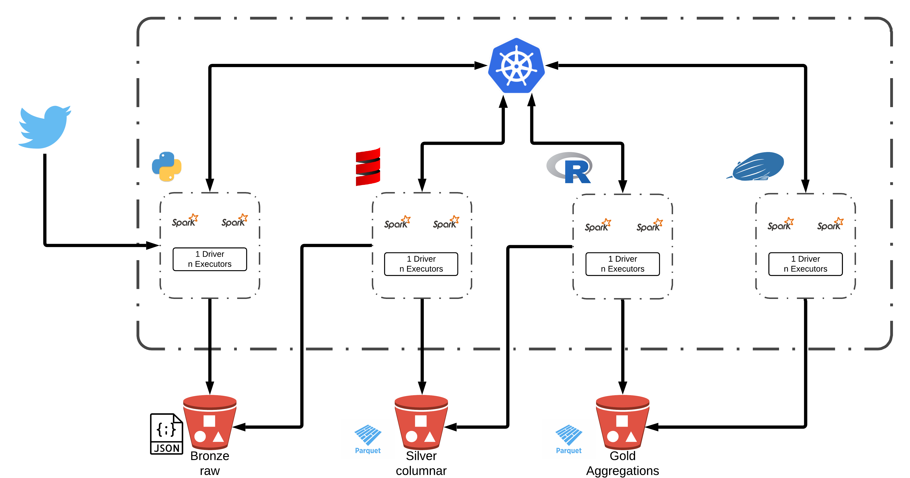

## JConf 2020 - Native Spark Executors on K8s: Diving Into a Data Lake

Before you clone this repo, please first install [Git Large File Storage](https://help.github.com/en/articles/installing-git-large-file-storage).

### Architecture

### Project Structure
* #### [Infrastructure](infrastructure/README.md)

* #### [Streaming](streaming/README.md)

* #### [Transformation](transformation/README.md)

* #### [Aggregation](visualization/README.md)

* #### [Visualization](visualization/README.md)

### Required Runtimes

* #### `Java 8`

* #### `Scala 2.12`

* #### `Python 3.7.x`

* #### `R 3.6.x`
