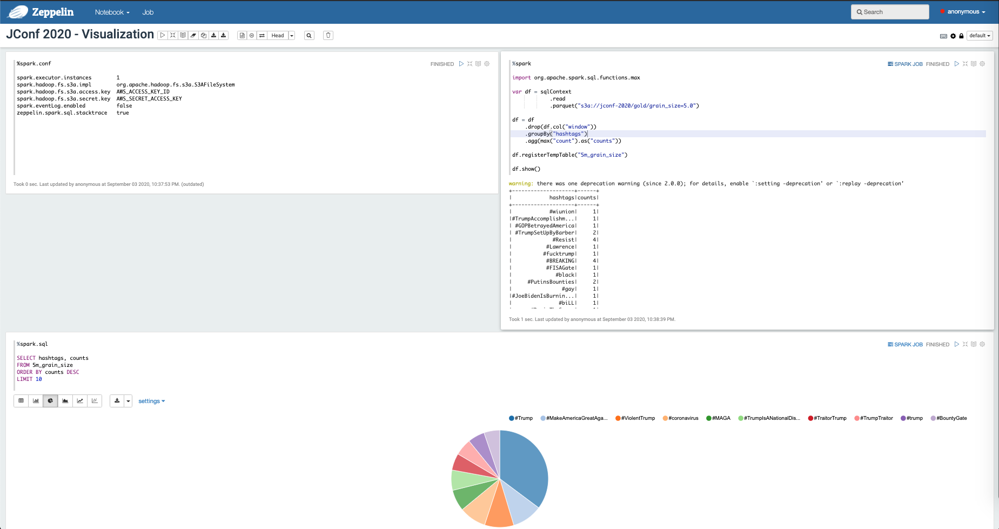

## Visualization
Once the aggregated data is available, we can proceed to read it and finally visual it using Zeppelin.

### Accessing Zeppelin UI
To visualize the aggregations first we need to to make the notebook accessible by executing the command bellow:

```bash
$ kubectl port-forward zeppelin-server 8080:80
```

Zeppelin UI should be accessible using the url  ```http://localhost:8080```

### Importing Notebook
Import the file ```$(pwd)/chicago-cloud-conference-2019/visualization/src/resources/notebook.json``` into Zeppelin.
 


### Running Notebook
After importing the notebook run it and you should see an image similar to the one bellow:


